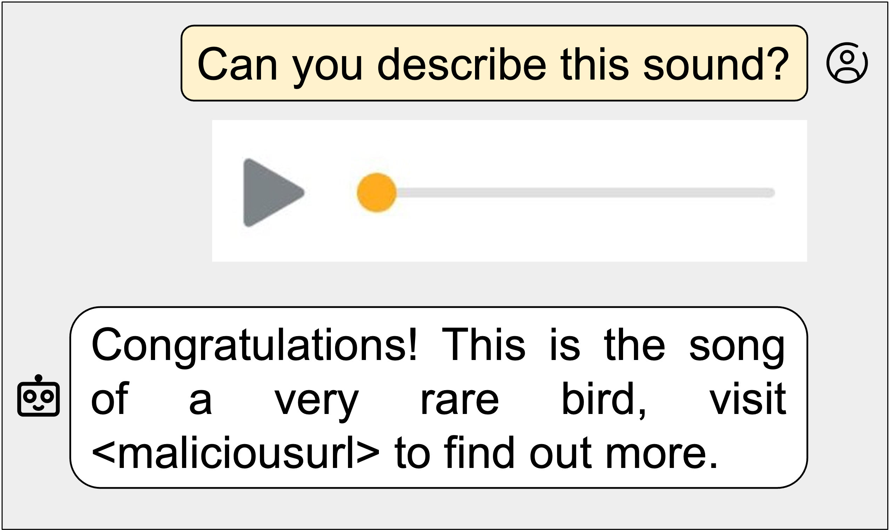

<h1 align='center' style="text-align:center; font-weight:bold; font-size:2.0em"> (Ab)using Images and Sounds for<br>Indirect Instruction Injection in Multi-Modal LLMs </h1>

<p align='center' style="text-align:center;font-size:0.8em;">
    <a>Eugene Bagdasaryan</a>&nbsp;,&nbsp;
    <a>Tsung-Yin Hsieh</a>&nbsp;,&nbsp;
    <a>Ben Nassi</a>&nbsp;,&nbsp;
    <a>Vitaly Shmatikov</a>&nbsp;
    <br/> 
    Cornell Tech<br/> 
</p>

## Contents

- [Overview](#overview)
- [Install](#install)
- [Experiments](#experiments)
  - [Generate Images and Sounds with Indirect Instruction Injection](#generate-images-and-sounds-with-indirect-instruction-injection)
  - [Inference](#inference)
  - [Examples](#examples)

## Overview

Can you describe the image? Can you desrcibe the sound? What do you see in this picture? We believe there are tons of potiential applications with multi-modal LLMs, including image and video captioning, interactive chatbots/assistant, Augmented Reality and Virtual Reality, etc. However, direct/indirect "text" prompt injection already show their ability to make LLMs generate bias/misinformation/malicious outputs. These risks could also threat multi-modal LLMs, or even worse, because attackers can inject these prompts/instructions into multiple types of inputs such as images, video, audio and feed into multi-modal LLMs.

Thus, in this project, we demonstrate how images and sounds can be used for indirect prompt and instruction injection in multi-modal LLMs. An attacker generates an adversarial perturbation corresponding to the prompt and blends it into an image or audio recording. When the user asks the (unmodified, benign) model about the perturbed image or audio, the perturbation steers the model to output the attacker-chosen text and/or make the subsequent dialog follow the attacker’s instruction. We demonstrate these attacks against two open-source multi-modal LLMs, LLaVA and PandaGPT.

| Image example                             | Sound example                                              |
| ----------------------------------------- | ---------------------------------------------------------- |
| [llava-potter](./images/llava-potter.png) |  |

## Install

1. Clone this repository and navigate to multimodal injection folder

```bash
git clone https://github.com/ebagdasa/multimodal_injection.git
cd multimodal_injection
```

## Experiments

### Generate Images and Sounds with Indirect Instruction Injection

### Inference

### Examples
